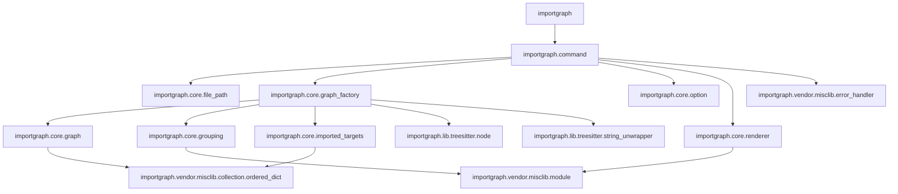

# importgraph.nvim

wip

## Example

```lua
local graph = require("importgraph").render({
  collector = {
    path_filter = function(path)
      return not path:match("test/helper")
    end,
  },
})
print(graph)
```

### Generated graph

