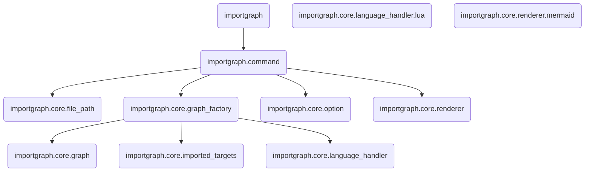

# importgraph.nvim

neovim plugin to generate import graph

## Example

```lua
local graph = require("importgraph").render({
  collector = {
    path_filter = function(path)
      return not path:match("/test") and not path:match("/vendor") and not path:match("/lib")
    end,
    imported_target_filter = function(name)
      return not name:match(".vendor.") and not name:match(".lib.")
    end,
  },
})
print(graph)
```

### Generated graph

